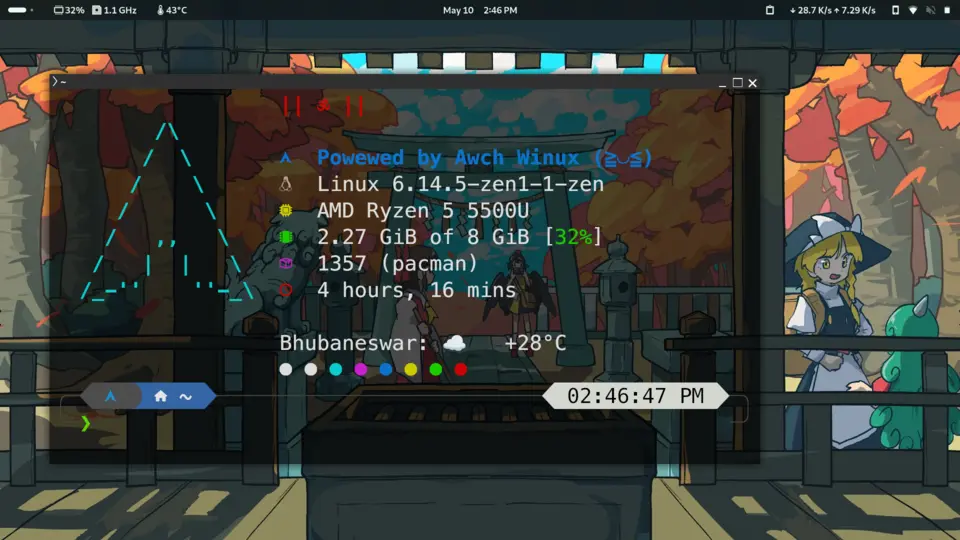

### Awch Winux Fastfetch config

[Wallpaper](https://danbooru.donmai.us/posts/6503608)

This repository holds my current fastfetch config, its just a silly random theme.

- My config file has the total RAM hardcoded, as I didn't like the decimals being displayed, you will need to change that in the config file yourself.
- My config file also uses a cached weather service which reads ``~/.weather_cache``, instead of using the default weather module of fastfetch, I found this to be more
convinient and fast. I created a systemd timer and service which would update cache file from wttr.in, you can check out my implementation at [neofetch-weather-cache](https://github.com/the-indian-dev/neofetch-weather-cache/)
